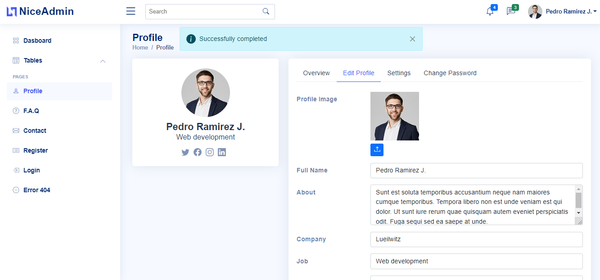

# Demo SPA Angular

## Description

Desarrollado para fines demostrativos y prácticos con [Angular CLI](https://github.com/angular/angular-cli) version 13.1.1, donde se plantean los siguientes requisitos:

- Realizar aplicación SPA con opciones de registro, login, perfil de usuario utilizando el framework boostrap como diseño de interfas.

- Se desea restringuir el acceso algunas rutas para que solo usuarios logeado puedan acceder

- Los campos de formularios deben tener validaciones y se debe mostrar los errores para cada campo.

- Se desea cargar imagen como avatar del perfil de usuario.

- Se desea que exista breadcrumb en cada página.

- Se desea mostrar mensajes de alertas al usuario cuando una operación ha sido realizada correcta o incorrectamente.

## Desarrollo

- Se utilizan la plantilla [NiceAdmin](https://bootstrapmade.com/nice-admin-bootstrap-admin-html-template/) y se apdata para el framework Angular 13.1.0

- Se crean [rutas](src/app/app-routing.module.ts) y componentes para las páginas login, register, profile, contact, faq, tables, error404.

- Los formulario de [login](src/app/views/pages/login/login.component.ts), [registro](src/app/views/pages/register/register.component.ts) y [perfil](src/app/views/pages/profile/profile.component.ts) se hacen reactivos con validaciones.

- Se crea las directivas **FormControlValidationDirective** y **FormSubmitValidationDirective** para mostrar los errores de validación en campos de formularios en eventos de modificación y submit.

- Se crea alert [component](src/app/components/alert/alert.component.ts) y [servicio](src/app/components/alert/alert.service.ts) con funcionalidades reactivas para mostrar mensajes de alertas.

- Se crea componente para la [carga de imagenes](src/app/components/upload-image/upload-image.component.ts) con eventos y atributos parametrizables.

- Se crea componente para la creacion de menú o [navegación](src/app/components/nav/nav.component.ts)

- Se crea [servicio](src/app/services/api.service.ts) para realizar peticiones al Api Rest como login, registro, obtener y actualizar datos del perfil, cargar imagen en el servidor.

- Se controla el acceso de usuario por [JWT](https://github.com/auth0/angular2-jwt) a las [rutas](src/app/app-routing.module.ts) _home_ y _profile_ con la implemetación de la interfás [CanActivate](src/app/services/auth.guard.ts).

- Se crea [interceptor](src/app/http.interceptor.ts) http para agregar en headers el JWT de seguridad, asi como controlar los errores que puedan haber ocurrido en la petición.

- Se crea [Servicio](src/app/services/main.service.ts) para [reaccionar](src/app/containers/default-layout/default-layout.component.ts) antes las modificaciones de los datos de usuario y las rutas (para cambiar el título y [breadcrumb](src/app/components/breadcrumb/breadcrumb.component.ts) de las páginas)

## Implementación de la solución

1. Clonar repositorio: https://github.com/yurisnel/InstaShareAngular
2. Descargar dependencias:

```bash
npm install
```

3. Ejecutar servidor:

```bash
npm start o ng serve
```

4. Abrir navegador en: http://localhost:4200/



**PD:** Este proyecto requiere de un Api Rest que esta desarrollado en https://github.com/yurisnel/InstaShareApiNest
